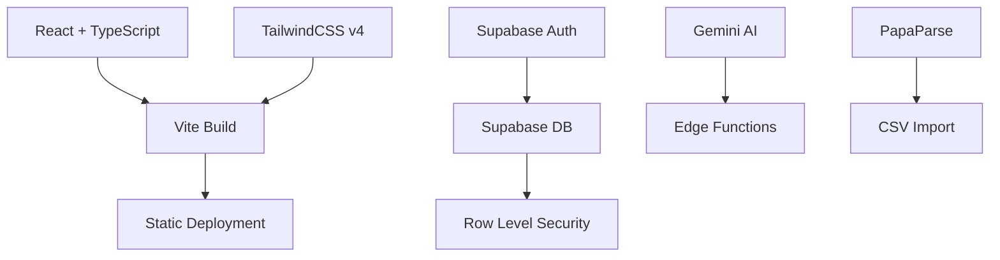

# BlackBox COO — Pitch Deck

> **AI-Powered Operations Dashboard for Solo Founders & Small Teams**

---

## Slide 1 — Title

**BlackBox COO**

*Your Virtual Chief Operating Officer*

The AI-powered operations dashboard that analyzes your entire business — sales, expenses, inventory, customers, and operations — and delivers executive reports, health scores, and tactical recommendations in seconds.

---

## Slide 2 — The Problem

### Solo founders are drowning in operational chaos.

- **85%** of solo founders and micro-businesses track operations manually (spreadsheets, notebooks, memory)
- **67%** say they spend more than 10 hours per week on operational admin
- **73%** make critical decisions without data — relying on gut feel
- **90%** can't afford a full-time COO or operations team

**The result:** Slow reaction time, missed opportunities, cash flow surprises, and burnout.

---

## Slide 3 — The Solution

### Meet BlackBox COO — your AI operations team in a single dashboard.

Upload your business data — or start with sample data — and let a fleet of specialized AI agents analyze everything at once.

| Module | What It Does |
|--------|-------------|
| **Finance Agent** | Revenue, expenses, profit margins, forecasts |
| **Sales Agent** | Customer retention, churn, upsell analysis |
| **Inventory Agent** | Stock levels, low-stock alerts, reorder suggestions |
| **Marketing Agent** | Campaign ideas, audience insights, growth opportunities |
| **Operations Agent** | Workflow efficiency, daily priorities |
| **CEO Agent** | Synthesizes everything into an executive report with a health score |

**Output:** A complete executive report with risks, opportunities, and prioritized action items — in seconds, not days.

---

## Slide 4 — How It Works

```
┌──────────────────────────────────────────────────────┐
│  1. ADD YOUR DATA                                    │
│  ───────────────────────                             │
│  Upload CSV/PDF  │  Manual entry  │  Sample data     │
└──────────────────────┬───────────────────────────────┘
                       ↓
┌──────────────────────────────────────────────────────┐
│  2. AI AGENTS ANALYZE EVERYTHING IN PARALLEL         │
│  ──────────────────────────────────────              │
│  Sales   Finance   Inventory   Marketing   Ops       │
│    ↓         ↓          ↓           ↓        ↓       │
│              ┌─────────────────┐                     │
│              │   CEO AGENT     │                     │
│              │   (Synthesizes) │                     │
│              └────────┬────────┘                     │
└───────────────────────┬──────────────────────────────┘
                        ↓
┌──────────────────────────────────────────────────────┐
│  3. EXECUTIVE REPORT DELIVERED                       │
│  ─────────────────────────────                       │
│  Health Score  │  Risks  │  Opportunities  │  Tasks  │
└──────────────────────────────────────────────────────┘
```

---

## Slide 5 — Target Market

### Primary Audience

- **Solo founders** — running their first or second business
- **Micro-businesses** — 1–10 employees
- **Freelancers & consultants** — who need business clarity
- **Sidepreneurs** — balancing a day job with their own venture

### Market Size

| Segment | Size | Addressable |
|---------|------|:-----------:|
| US solo founders | 24M | $480M |
| Global micro-businesses | 200M+ | $2B+ |
| Freelance economy | 1.2B (global) | $1.5B+ |

---

## Slide 6 — Business Model

| Tier | Price | Key Features |
|------|:-----:|--------------|
| **Free** | $0 | Up to 500 records, 1 workspace, basic reports |
| **Pro** | $29/mo | Unlimited records, 5 team members, advanced AI, API access |
| **Enterprise** | Custom | Unlimited team, SSO, custom AI tuning, on-premise |

**Revenue levers:**
- Monthly SaaS subscriptions → predictable MRR
- AI credits / usage upsell → higher-value customers
- Enterprise onboarding & custom integration → services revenue

---

## Slide 7 — Competitive Advantage

### Why BlackBox COO wins

| Factor | Spreadsheets | Other SaaS | BlackBox COO |
|--------|:-----------:|:----------:|:------------:|
| Multi-agent AI analysis | ❌ | ❌ (single model) | ✅ |
| Executive report synthesis | ❌ | ❌ | ✅ |
| Works offline (fallback engine) | ✅ | ❌ | ✅ |
| CSV/PDF import | ✅ | ✅ | ✅ |
| Setup time | Immediate | Weeks | **Minutes** |
| Monthly cost | $0 | $50–500+ | **$0–29** |
| Designed for solopreneurs | ❌ | ❌ | ✅ |

### Key Differentiator
**BlackBox COO isn't just a dashboard — it's a virtual COO.** Other tools show you data. We analyze it, synthesize it, and tell you what to do.

---

## Slide 8 — Traction & Roadmap

### Current Status
- ✅ Multi-agent AI pipeline (6 specialized agents)
- ✅ Executive dashboard with health scores
- ✅ Data import (CSV, PDF) with AI parsing
- ✅ Supabase authentication & Row Level Security
- ✅ 20+ pages covering all business modules
- ✅ AI fallback engine (works without API key)
- ✅ Team management & onboarding
- ✅ Executive report generation & export

### Roadmap

| Quarter | Milestones |
|:-------:|------------|
| **Q1** | Launch v1.0 • Public beta • 50 signups |
| **Q2** | Slack integration • Custom report templates • API release |
| **Q3** | Multi-company workspaces • Advanced AI tuning • Billing |
| **Q4** | Mobile app • Marketplaces & POS integrations • Enterprise SSO |

---

## Slide 9 — Technology

### Stack



- **Frontend:** React 18, TypeScript, TailwindCSS v4, Recharts
- **Backend:** Supabase (PostgreSQL, Auth, Edge Functions)
- **AI:** Google Gemini API or rule-based fallback engine
- **Infrastructure:** Vite build → deploy to any static host

---

## Slide 10 — Team

**Founder / Product Lead**
Full-stack developer & solo founder who built BlackBox COO to solve their own operational chaos.

*"I built the tool I wished existed when I was running my first business alone."*

### Why now?
1. **AI maturity** — Gemini/LLM APIs are finally affordable and capable enough for production
2. **Remote-first world** — More solo founders than ever (up 40% since 2020)
3. **No-code + AI** — Users expect intelligence, not just data entry

---

## Slide 11 — Ask

### What We're Seeking

**$250,000 Seed Round**

| Use | Amount |
|-----|:------:|
| AI model costs & scaling | $80,000 |
| Engineering (1 senior hire) | $100,000 |
| Marketing & growth | $50,000 |
| Operations & legal | $20,000 |

### What you get
- **12-month runway** to reach 5,000 paying subscribers
- **Clear path to $150K MRR** from $29/mo Pro tier
- **First-mover advantage** in the "AI COO for solopreneurs" category

---

## Slide 12 — Closing

**BlackBox COO**

*Your business intelligence. Your virtual COO. In one dashboard.*

**Try it free:** [blackboxcoo.app](https://blackboxcoo.app)

---

*"I used to spend every Sunday night preparing spreadsheets. Now I open BlackBox COO, get my report, and enjoy Sunday." — Beta Tester*

---

<p align="center">
  <sub>Contact: hello@blackboxcoo.app</sub>
</p>